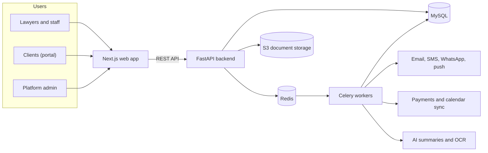
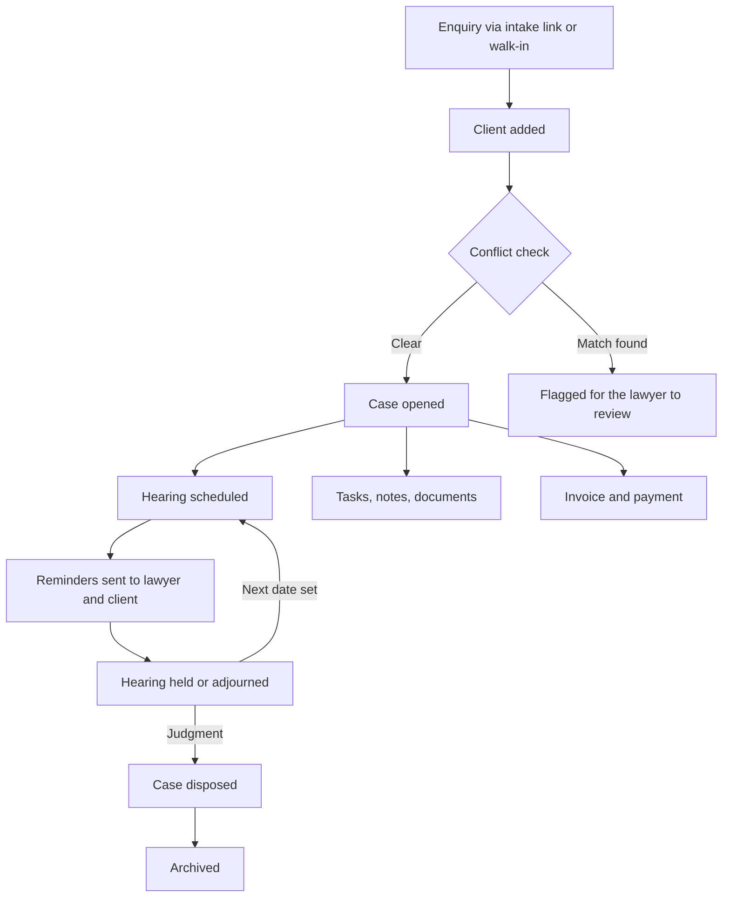
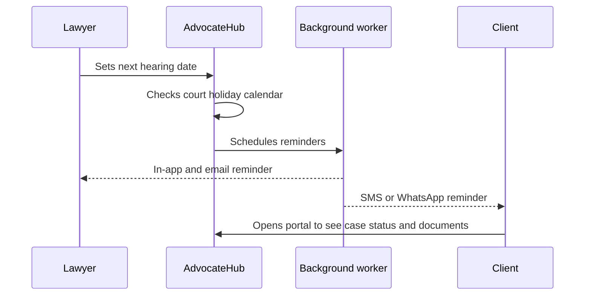
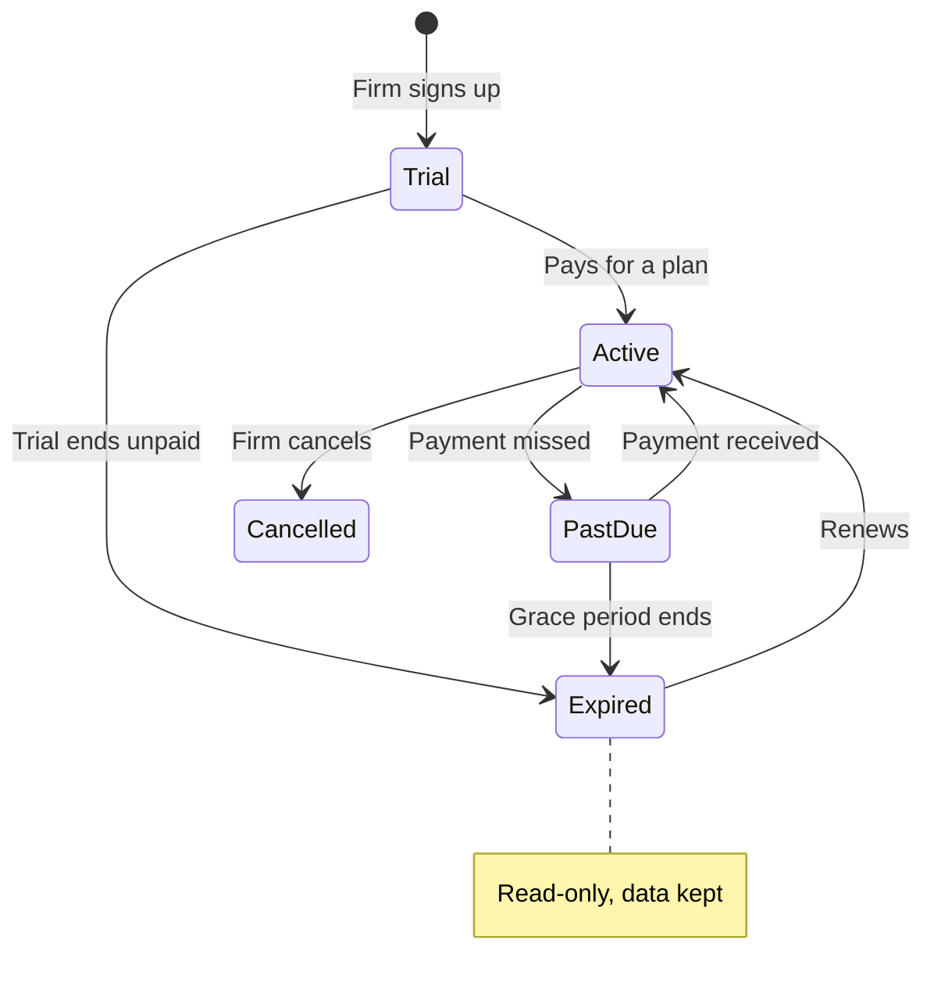

## What I built

- A multi-tenant SaaS where each law firm gets its own private workspace for clients, cases, hearings, meetings, tasks, notes, and documents.
- A hearing and meeting tracker with a shared calendar and automatic reminders by in-app notification, email, SMS, and WhatsApp, so lawyers stop missing dates.
- A client portal where the firm's clients see case status, the next hearing date, shared documents, and invoices, and can message the lawyer instead of phoning for updates.
- Billing for firms (subscription plans, trials, usage limits, online payment) and for their clients (fee agreements, time and expenses, invoices, payments).
- A platform admin console to manage firms, plans, trials, offline payments, and data export or deletion.
- A Bangla and English interface built for Bangladeshi practice: local courts and judges, a court holiday calendar, and a court fee calculator.

## Who it is for

| User | What they get |
| --- | --- |
| Solo advocate | One place for every client, case, and hearing date, on a low-cost plan |
| Law firm or chamber | Team roles and permissions, task assignment, shared calendar, reports, audit log |
| The firm's clients | A free portal for case status, next date, documents, and messages |
| Platform operator | A console for firms, subscriptions, revenue, and support |

## Key features

- **Clients and cases** with custom fields, tags, case parties, and a conflict-of-interest check against opposite parties at intake.
- **Hearings** with next date, adjournment history, court notes, and a warning when a date falls on a court holiday.
- **Documents** in per-case folders with versioning, virus scanning, previews, sharing with the client, and acknowledgement receipts.
- **Notes** kept strictly internal or shared with the client, so private notes never reach the portal.
- **Public intake link** that turns website or walk-in enquiries into screened leads.
- **Global search** across clients, cases, case numbers, mobile numbers, and document text.
- **Dashboard and reports** showing today's hearings, upcoming dates, outstanding fees, and firm performance, with CSV export.
- **Integrations**: SSLCommerz payments, SMS gateway, WhatsApp Business, Google and Outlook calendar sync, push notifications (installable PWA), and API keys with webhooks.
- **AI assistance** that summarizes cases and documents and classifies uploaded files.

## How it works

The web app handles the screens; the backend owns all business rules and data. Anything slow (sending reminders, scanning uploads, generating reports, AI work) runs in background workers, so the app stays fast for the user.

## A case from start to finish

## How a reminder reaches the client

## Subscription lifecycle

A firm whose subscription lapses moves to read-only mode instead of being locked out, so its records are never lost.

## Security and data protection

- Every firm's data is isolated, and an automated test suite checks that no firm can read another firm's records.
- Role-based permissions (owner, admin, senior and junior lawyer, paralegal, staff, accountant), with an audit log of every change.
- Optional two-factor sign-in and session management.
- Uploaded files are virus-scanned and served through short-lived, signed links.
- Firms can export all their data or request deletion.
